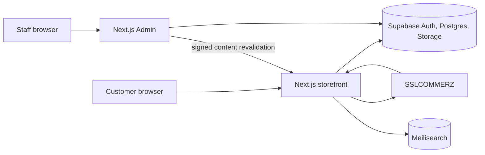

# Architecture

## Ownership

- Supabase Postgres is authoritative for products, prices, inventory, carts, orders, payments, customers, editorial content, settings, inquiries, and audit evidence.
- Supabase Auth stores customer and staff identities. `staff_members`, `staff_roles`, RLS, and `has_permission()` form the staff authorization layer.
- Supabase Storage holds public product media. Upload and mutation policies require `catalog:manage`.
- Meilisearch is a disposable projection rebuilt from verified Supabase records.
- The storefront owns customer-facing workflows and same-origin server routes. The Admin app owns authorized business operations.

## Trust boundaries

Browser code receives only the Supabase anon key. Customer and staff sessions remain RLS-scoped. Service-role credentials are imported only by server actions, route handlers, release scripts, and trusted payment/webhook code.

Guest cart, checkout, inquiry, and payment writes pass through same-origin Next.js routes. Checkout RPC execution is restricted to `service_role`; public callers cannot invoke money-moving functions directly. Staff mutations are checked in both the server action and RLS policy. Important changes write to an append-only administrator ledger.

Admin auth cookies are refreshed in `apps/admin/src/proxy.ts`. Cross-site unsafe requests are rejected, and production responses set CSP, HSTS, clickjacking, MIME-sniffing, referrer, opener, resource, and permissions policies.

## Failure behavior

Production never invents stock, price, payment, provenance, or verified content. If Supabase is unavailable, authenticated operations fail closed. Storefront fixtures are local-only and non-purchasable. Cache-revalidation failures are recorded and surfaced to editors without pretending a database save failed.
