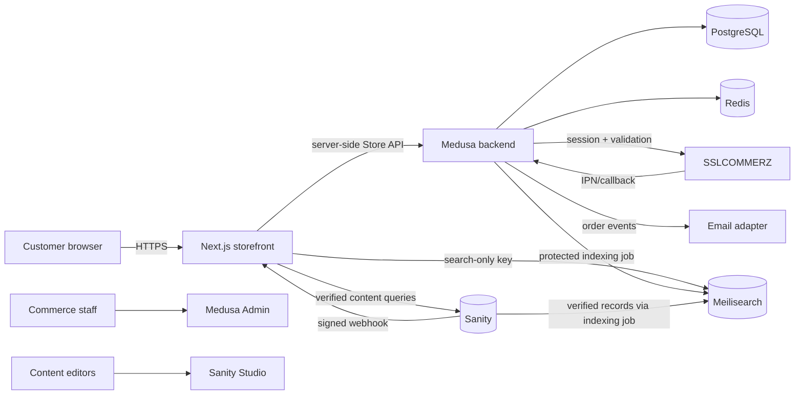

# Architecture

## System view

## Application boundaries

- The storefront owns presentation, destination/language state, server-only commerce proxy routes, public validation, structured data, and accessible interaction behavior. It does not own products, payment truth, or editorial truth.
- Medusa owns catalog identity, variants, regional prices, inventory, carts, promotions, customers, orders, fulfillment state, gift order metadata, inquiries, and payment audit records. Its Admin extensions expose Bangla Blend operations without mixing admin code into the storefront.
- Sanity owns narrative product enrichment, recipes, regions, sourcing stories, authors, pages, campaigns, translations, and editorial verification evidence. Medusa IDs are references, not duplicated commerce state.
- Meilisearch owns a disposable search projection. It is rebuilt from Medusa and verified Sanity records and is never the source of truth.
- Shared packages define narrow contracts and validation without coupling application runtimes.

## Data and request flows

The browser sends cart, account, checkout, and inquiry mutations to same-origin Next.js routes. Those routes validate input, attach server-held credentials/cookies, and call Medusa. Cart and auth identifiers use `HttpOnly`, `SameSite=Lax`, secure-in-production cookies. Search calls the server route, which applies the selected-market filter before querying Meilisearch.

Product pages join live Medusa commerce data with optional verified Sanity enrichment. If a service is unavailable during local development, a labeled fixture can render; it cannot be added to cart. Production fails closed instead of inventing stock, price, provenance, or certification data.

SSLCOMMERZ begins at Medusa. The provider creates a server-side session and returns only the gateway URL. IPN data is remotely validated and checked against amount, currency, and order reference before authorization. Redirect routes only communicate status to the customer.

## Security boundaries

- Gateway, Sanity write, Meilisearch admin, database, and email credentials are server-only.
- CSP and other security headers are set by the storefront. Production ingress adds TLS, request-size limits, bot controls, and rate limits.
- Public input is schema-validated; Medusa authorization protects staff APIs. Browser content renders through React/Portable Text serializers, not arbitrary HTML.
- Webhooks use provider validation or an HMAC signature and must be replay-safe. Payment audit records store safe fields and hashes, not credentials or raw card data.
- Market selection never overrides backend inventory, regional pricing, shipping, or product eligibility.
